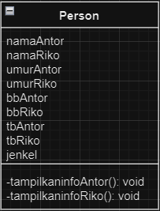
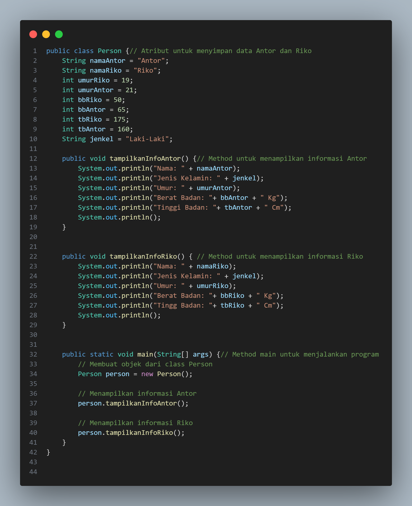
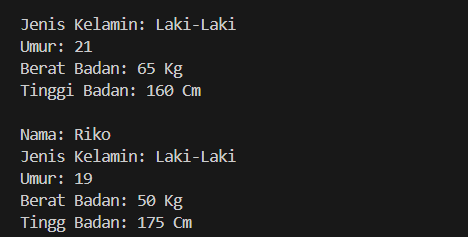
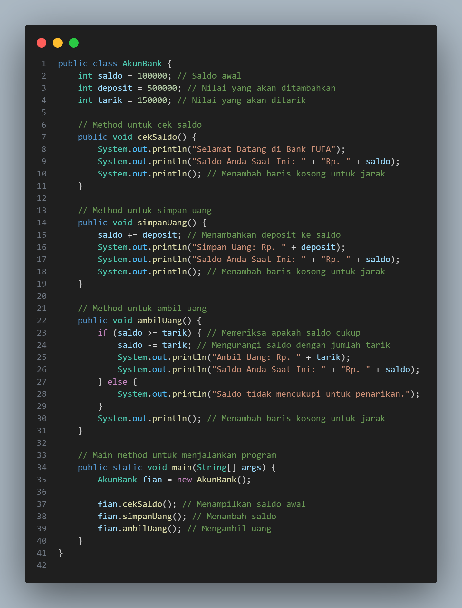
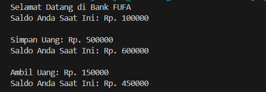

# Pertemuan 3
# Latihan 
### Made By Alfian Nur Rizki
### NIM 312310665

1. Persoalan 

+ 
Apa yang harus didefinisikan sebelum membuat objek?

+ 
Buatlah gambar diagram class dan dua buah objek dari class Person bernama Antor dan Riko.

+ 
Diagram Person

+ 
Buatlah gambar diagram objek AkunBank dengan instance method simpanUang, ambilUang dan cekSaldo.

2. Jawaban 

+ 
Sebelum membuat objek dalam pemrograman berorientasi objek (OOP), yang harus didefinisikan adalah kelas. Kelas didefinisikan dengan properti dan perilaku yang diinginkan.

# Latihan 2

Buatlah kode program java untuk:

+ 
Mendeklarasikan class Person, dengan atribut Nama,JenisKelamin, Umur

+ 
Buatlah dua buah objek dari class Person bernama Antondan Riko

+ 
Program Person

+ 
Output Person

# Latihan 3

Buatlah kode java untuk:

+ 
Mendeklarasikan class AkunBank dengan instance method simpanUang, ambilUang dan cekSaldo

+ 
Buat objek AkunBank dan tetapkan nilai saldo awal Rp. 100000, kemudian panggil 3 method tersebut dan tampilkan proses berikut:

+ 
Program AkunBank

+ 
Output AkunBank

Sekian Laporan Praktikum Pertemuan 3 Adios

